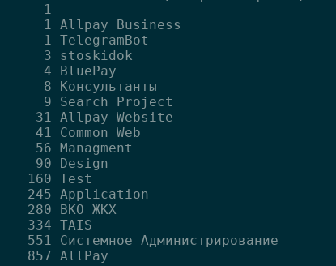
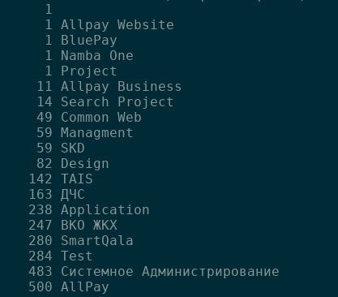
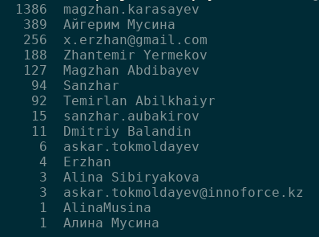
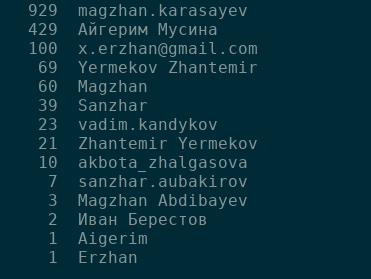
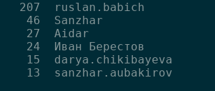
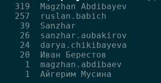
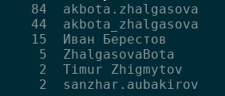
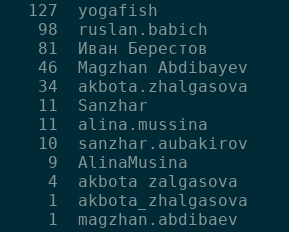
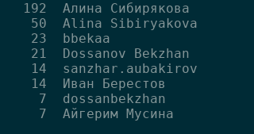
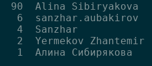

## 28.12.18

- Итоги
- Анализ
- Планы

---

## Итоги. Бизнес

- Завершили ВКО
- Техноспринт 2
- Переезд в АКБ
- Консервация 100skidok и ДЧС
- Прототип Смарткала и NambaPay
- Переезд в allpay PG

---

## Итоги. IT

- Graylog
- ReportPortal
- Автотесты контрактов и бизнес логики
- Полноценный CI/CD
- Документация

Note: В этом году у нас появился graylog, думаю все ощутили его полезность и стали более ответственно относится к логгированию. У нас появился ReportPortal, который показывает нам деградацию наших приложений. Появился полноценный CI/CD, раньше мы проводили деплой в продакшн руками. Мы стали писать техническую документацию

+++?image=assets/images/graylog.png&size=auto 100%

+++?image=assets/images/reportportal.jpg&size=auto 100%

---

## Статистика

- Jira 2614/2671
- Discourse 150/151
- Gitlab 

+++

## Jira

+++

## Git

+++

## Git SQ/VKO

+++

## Git SQ/VKO

+++

## Git Android SQ/AP

---

## Gitlab

- Пятница или четверг?
- Время коммитов
- Более 10К коммитов

+++?image=assets/images/chart-ap.png&size=auto 100%
+++?image=assets/images/chart-sq-api.png&size=auto 100%
+++?image=assets/images/chart-sq-front.png&size=auto 100%
+++?image=assets/images/chart-ap-android.png&size=auto 100%
+++?image=assets/images/chart-sq-android.png&size=auto 100%

---

## Планы

- Активные продажи
- SQ
- NambaPay
- Астана-1

---

## Цели

- Получить стабильный приток денег
- Создать отдел службы поддержки
- Реорганизовать отдел бизнес аналитики
- Расширить отдел тестирования
- Построить облако

---

## Люди

- Уходит Акбота
- Начинает работу Тимур
- Айдар

---

## Поздравляю всех с новым годом!

